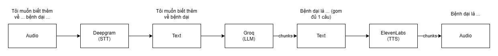

# edoctor-ai

Voice AI Assistant.

## Prerequisites

- Node.js >= 22 (LTS)
- Deepgram Account
- Groq Account
- ElevenLabs Account

## Setup

> Change the terminal to `Bash`

Install packages:

```bash
npm install
```

Run:

```bash
npm run dev
```

## Note

Only Vietnamese is supported. You can change the language in the Deepgram and ElevenLabs settings to a supported one

## Workflow


